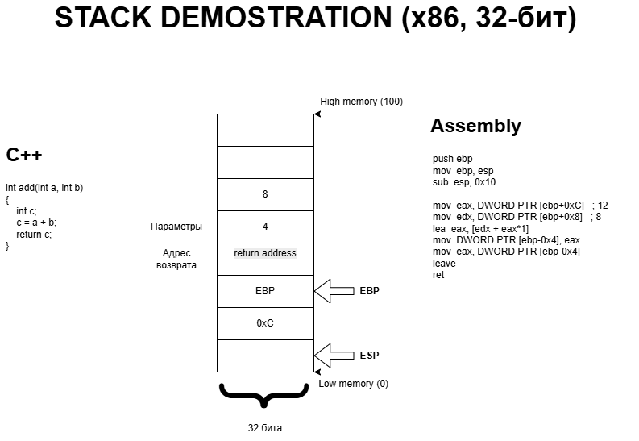

# Manim Stack Visualization

Проект для иллюстрации работы **стека** и **виртуальной памяти** с анимациями в **[ManimCommunity](https://github.com/ManimCommunity/manim)**.  
Целевой формат для вставки в слайды: **16:9**. 

## Ожидаемая визуализация

## Что будет в анимации
- Прямоугольник линейного адресного пространства, разбитый на ячейки, со стрелкой роста адресов **сверху вниз**.  
- Подписи граничных адресов.  
- Элементы стека «ложатся» внутрь ячеек.  
- **RSP** и **RBP**: два статичных блока в правом верхнем углу, с «вспышкой» при обновлении и стрелками на текущие адреса.  
- Кадр стека одной функции: аргументы → адрес возврата → локальные переменные.  
- Параллельный показ строк **C/C++** и соответствующего **ASM** (подсветка/выделение/движение).  
- Ещё **3 кадра стека** для последовательных вызовов функций.
